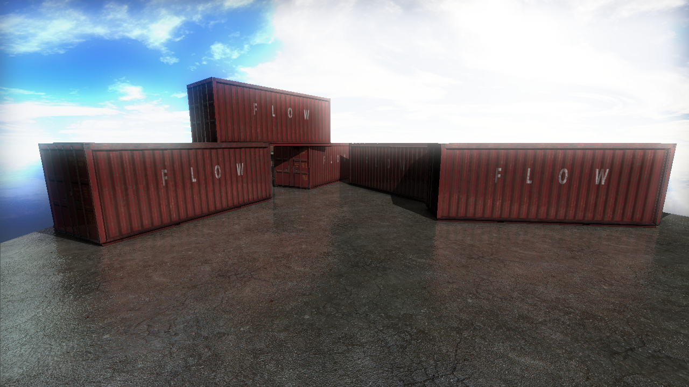

# GPU-Accelerated Software Rasterizer
[Video Demonstration](https://www.youtube.com/watch?v=yXUcj-AIQ24)

### Features
* OpenCL GPU Shading
  * Perspective Correct Interpolation
  * GPU Data Flow Optimisations
  * CPU-GPU Communication Optimisations
* Chunked-Halfspace Rasterization on CPU
* Wavefront (.obj) Model Loading
* Naive Clipping and Backface Culling
* Deferred Rendering Pipeling
  * Screen-Space Ambient Occlusion
  * Lighting and Shadow Mapping
  * Textures and Texture Filtering
  * Material System
    * Normal Mapping with Specular Highlights
    * Reflections and Environment Mapping using CubeMaps
